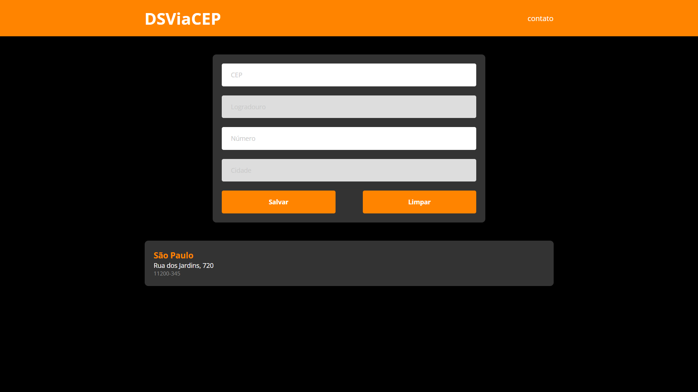

# 📍 DSViaCEP

Aplicação front-end desenvolvida com **HTML**, **CSS** e **JavaScript**, com integração à API pública **ViaCEP** para busca e preenchimento automático de endereço a partir do CEP informado.

O projeto permite consultar um CEP, preencher automaticamente os dados retornados pela API, informar o número do endereço e salvar o resultado em uma lista exibida na interface.

## 🔗 Links

- **Repositório:** [DSViaCEP](https://github.com/MiltonRafaeel/DSViaCEP)
- **API utilizada:** [ViaCEP](https://viacep.com.br/)
- **Figma:** [Design](https://www.figma.com/design/idfHqxib6cRdqPQIcCy8HA/DSViaCEP?node-id=0-1&p=f&t=jvwFLkKuRQb0hwYA-0)

> Se você tiver protótipo no Figma e ele estiver alinhado com a interface implementada, vale a pena colocar o link aqui.

## 🖼️ Preview



## ✨ Funcionalidades

- Busca de endereço a partir do CEP
- Preenchimento automático de **logradouro** e **cidade**
- Campo para informar o **número**
- Validação de campos obrigatórios
- Exibição de mensagens de erro no formulário
- Salvamento do endereço em lista na própria página
- Limpeza do formulário
- Modal de contato na interface

## 🛠️ Tecnologias utilizadas

- HTML5
- CSS3
- JavaScript
- ES Modules
- Fetch API
- API pública ViaCEP

## 🧠 Conceitos praticados

Este projeto foi importante para praticar:

- manipulação do DOM
- organização modular com JavaScript
- separação de responsabilidades
- consumo de API externa
- tratamento básico de erros
- validação de formulário
- renderização dinâmica de elementos na tela

## 🏗️ Estrutura do projeto

O projeto foi organizado de forma modular, separando responsabilidades entre controllers, services e models:

```text
projeto-cep/
├── css/
│   ├── buttons.css
│   ├── modal.css
│   └── style.css
├── js/
│   ├── controllers/
│   │   ├── form-controller.js
│   │   ├── list-controller.js
│   │   ├── modal-controller.js
│   │   └── page-controller.js
│   ├── models/
│   │   └── address.js
│   ├── services/
│   │   ├── address-service.js
│   │   ├── request-service.js
│   │   └── exceptions/
│   └── dsviacep.js
└── index.html
